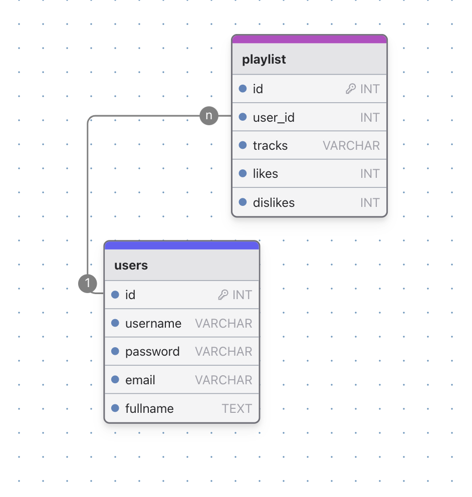
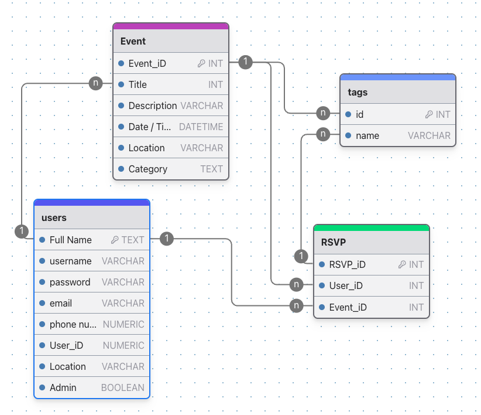

# SEI SEBPT220 Project 3: Event Flow

Event Flow is an experience coordination application enabling user to seamlessly RSVP to popular events in their area.

## How It Works

Registered users of can create and coordinate events. Users can additionaly RSVP to popular events in their area.

## Event-Flow-Backend

Backend Web Server. Servring RESTful API using Node.JS and Express.

## Features

### TBD

- **TBD:** TBD Description.
- **TBD:** TBD Description.

### TBD

- **TBD:** TBD Description.
- **TBD:** TBD Description.

### TBD

- **TBD:** TBD Description.
- **TBD:** TBD Description.

### TBD

- **TBD:** TBD Descriptiono.

### TBD

- **TBD:** TBD Description

## User Stories

1. **Create an account:**
   - TBD.
2. **TBD:**
   - TBD.
3. **TBD:**
   - TBD.
4. **TBD:**
   - TBD.

## Setup Instructions for Local Deployment

To set up this project locally, follow these steps:

1. **Clone the repository:**

   ```bash
   git clone 
   ```

2. **Navigate to the project directory:**

   ```bash
   cd 
   ```

3. **Install dependencies:**

   ```bash
   npm install
   ```

4. **Set up the environment variables:**

   - Create a `.env` file in the root directory.
   - Add the following environment variables:
     ```
     PORT=3000
     MONGODB_URI=your_mongodb_connection_string
     SECRET_KEY=your_secret_key
     ```

5. **Run the application:**

   ```bash
   npm start
   ```

6. **Open your browser and visit:**
   ```
   http://localhost:3000
   ```

## Live Demo

[Live Demo Site]()

## Models

### User

- **TBD:** TBD
- **TBD:** TBD

## Code Snippets

### TBD

```js

```

### TBD

```js
router.post('/', async (req, res) => {
  const { title, description, date, time, location, category, organizer } = req.body;
  const event = new Event({ title, description, date, time, location, category, organizer });
  await event.save();
  res.status(201).send('Event created');
});

```


## Inspiration

- [EventBrite](https://www.eventbrite.com/)
- [GetYourGuide](https://www.getyourguide.com/)
- [Lu Ma](https://lu.ma/)
- [AirTable](https://www.airtable.com/)

## Mockups




```

```
