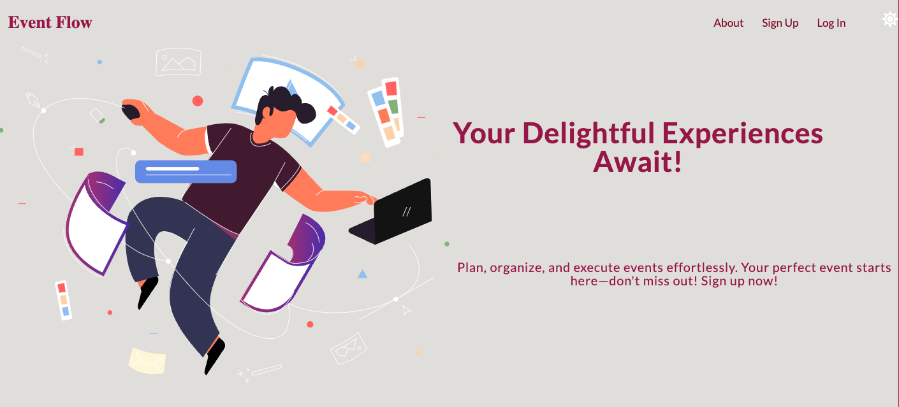

# SEI SEBPT220 Project 3: Event Flow

Event Flow is an experience coordination application enabling user to seamlessly RSVP to popular events in their area.



## How It Works

Registered users of can create and coordinate events. Users can additionally RSVP to popular events in their area.
Users can edit and delete the events they created and also view other users' events made. They can also see their events in my events link and also see the events they rsvp'ed in rsvp link. 

## Event-Flow-Backend

Backend Web Server. Servering RESTful API using Node.JS and Express. MongoDB, Mongoose, JWT, bcrypt.js, dotenv, and Render for deployment.

## Features

User Routes
- **POST /users/signup:** Register a new user.
- **POST /users/signin:** Sign in an existing user.
- **POST /users:** Create a new user (admin only).
- **GET /users:** Get a list of all users.
- **PUT /users/:id:** Update user details.
- **DELETE /users/:id:** Delete a user (admin only).

Event Routes
- **POST /events:** Create a new event.
- **GET /events:** Get a list of all events.
- **GET /events/:id:** Get details of a specific event.
- **PUT /events/:id:** Update event details.
- **DELETE /events/:id:** Delete an event.
- **GET /events/myevents:** Get all events created by the logged-in user.
- **GET /events/category/:category:** Get all events in a specific category.

RSVP Routes
- **POST /rsvp/:eventId/rsvp:** RSVP to an event.
- **GET /rsvp:** Get a list of all RSVPs.
- **GET /rsvp/:id:** Get details of a specific RSVP.
- **PUT /rsvp/:id:** Update RSVP details.
- **DELETE /rsvp/:id:** Delete an RSVP.
- **GET /rsvp/myrsvp:** Get all RSVPs of the logged-in user.

Tag Routes

- **POST /tags:** Create a new tag.
- **GET /tags:** Get a list of all tags.
- **GET /tags/:id:** Get details of a specific tag.
- **PUT /tags/:id:** Update tag details.
- **DELETE /tags/:id:** Delete a tag.
- **GET /tags/mytags:** Get all tags created by the logged-in user.


## User Stories
1. **Create an account:**
   - User is able to register for an account so that he or she can log in and access the application. The sign up page  will show all the necessary fields the user would need to input to sign up. 
2. **Sign in to account:**
   - User is able to sign in to his or her account after sign up form is submitted. Once signed in user can access his or her personalized event dashboard.
3. **Create an event:**
   - User is able to create events with details such as title, description, date, time, location, and category so that others can view and RSVP. 
4. **RSVP to an event:**
   - User is able to RSVP to events he or she is interested in so that the event organizer knows he or she will be attending.
5. **View my events:**
   - User can view all of his or her events he or she has created. By viewing all of his or her events, user can edit or delete the event made by him or her. 
6. **View events by category:**
   - User can see events in a specific category so that he or she can find events of his or her interest.


## Models

User Model (`models/user.js`)
Defines the schema for user data including:
- `username`: A unique identifier for the user.
- `hashedPassword`: The user's hashed password.
- `role`: The user's role, either 'user' or 'admin'.
- `name`: The user's full name.
- `phoneNumber`: The user's contact number.
- `country`: The user's country of residence.
- `state`: The user's state of residence.
- `email`: The user's email address.

Event Model (`models/event.js`)
Defines the schema for event data including:
- `title`: The title of the event.
- `description`: A brief description of the event.
- `date`: The date of the event.
- `time`: The time of the event.
- `country`: The country where the event is taking place.
- `state`: The state where the event is taking place.
- `category`: The category of the event (e.g., Birthday, Wedding).
- `organizer`: The user organizing the event.
- `rsvp`: A list of RSVPs for the event.
- `tags`: A list of tags associated with the event.

RSVP Model (`models/rsvp.js`)
Defines the schema for RSVP data including:
- `user`: The user who RSVPed to the event.
- `event`: The event to which the user RSVPed.
- `registration`: A boolean indicating if the user is registered for the event.

Tag Model (`models/tag.js`)
Defines the schema for tag data including:
- `name`: The name of the tag.


## Setup Instructions for Local Deployment

To set up this project locally, follow these steps:

1. **Clone the repository:**

   ```bash
   git clone 
   ```

2. **Navigate to the project directory:**

   ```bash
   cd 
   ```

3. **Install dependencies:**

   ```bash
   npm install
   ```

4. **Set up the environment variables:**

   - Create a `.env` file in the root directory.
   - Add the following environment variables:
     ```
     MONGODB_URI=your_mongodb_connection_string
     SECRET_KEY=your_secret_key
     SECRET=secret
     ```

5. **Run the application:**

   ```bash
   npm start
   ```

6. **Open your browser and visit:**
   ```
   http://localhost:3000
   ```

## Live Demo

[https://event-flow-app.netlify.app]()

## Models

## Code Snippets

Backend Users Routes - Signup / Signin 
```js
router.post('/signup', async (req, res) => {
  try {
    console.log('Received signup request:', req.body);
    const userInDatabase = await User.findOne({ username: req.body.username });
    if (userInDatabase) {
      return res.status(400).json({ error: 'Username already taken.' });
    }
    const user = await User.create({
      username: req.body.username,
      hashedPassword: bcrypt.hashSync(req.body.password, SALT_LENGTH),
      name: req.body.firstName + ' ' + req.body.lastName,
      phoneNumber: req.body.phone,
      country: req.body.country,
      state: req.body.state,
      email: req.body.email
    });
    const token = jwt.sign(
      { username: user.username, _id: user._id },
      process.env.JWT_SECRET
    );
    res.status(201).json({ user, token });
  } catch (error) {
    res.status(400).json({ error: error.message });
  }
});

router.post('/signin', async (req, res) => {
  try {
    const user = await User.findOne({ username: req.body.username });
    if (user && bcrypt.compareSync(req.body.password, user.hashedPassword)) {
      const token = jwt.sign(
        { username: user.username, _id: user._id },
        process.env.JWT_SECRET
      );
      res.status(200).json({ token });
    } else {
      res.status(401).json({ error: 'Invalid username or password.' });
    }
  } catch (error) {
    res.status(400).json({ error: error.message });
  }
});
```

Backend Events Routes - My Events / Category / Event Created / Event iD
```js
router.get('/myevents', isLoggedIn, async (req, res) => {
  try {
    const events = await Event.find({ organizer: req.user._id }).populate('organizer tags rsvp');
    res.status(200).json(events);
  } catch (error) {
    res.status(400).json({ error: error.message });
  }
});

router.get('/category', isLoggedIn, async (req, res) => {
  try {
    const category = req.query.category; 
    console.log(category);
    const events = await Event.find({ category }).populate('organizer tags rsvp');
    res.status(200).json(events);
  } catch (error) {
    res.status(400).json({ error: error.message });
  }
});

router.get('/', isLoggedIn, async (req, res) => {
  try {
    const events = await Event.find().populate('organizer tags rsvp');
    res.status(200).json(events);
  } catch (error) {
    res.status(400).json({ error: error.message });
  }
});

router.get('/:id', isLoggedIn, async (req, res) => {
  try {
    const event = await Event.findById(req.params.id).populate('organizer tags rsvp');
    res.status(200).json(event);
  } catch (error) {
    res.status(400).json({ error: error.message });
  }
});
```

Backend Routes RSVP - RSVP created / My RSVP
```js
router.get('/', isLoggedIn, async (req, res) => {
  try {
    const rsvps = await RSVP.find().populate('user event');
    res.status(200).json(rsvps);
  } catch (error) {
    res.status(400).json({ error: error.message });
  }
});

router.get('/myrsvp', isLoggedIn, async (req, res) => {
  try {
    const rsvps = await RSVP.find({ user: req.user._id }).populate('user event');
    res.status(200).json(rsvps);
  } catch (error) {
    res.status(400).json({ error: error.message });
  }
});

router.get('/:id', isLoggedIn, async (req, res) => {
  try {
    const rsvp = await RSVP.findById(req.params.id).populate('user event');
    res.status(200).json(rsvp);
  } catch (error) {
    res.status(400).json({ error: error.message });
  }
});
```


## Inspiration

- [EventBrite](https://www.eventbrite.com/)
- [GetYourGuide](https://www.getyourguide.com/)
- [Lu Ma](https://lu.ma/)
- [AirTable](https://www.airtable.com/)

## Mockups


```

```
